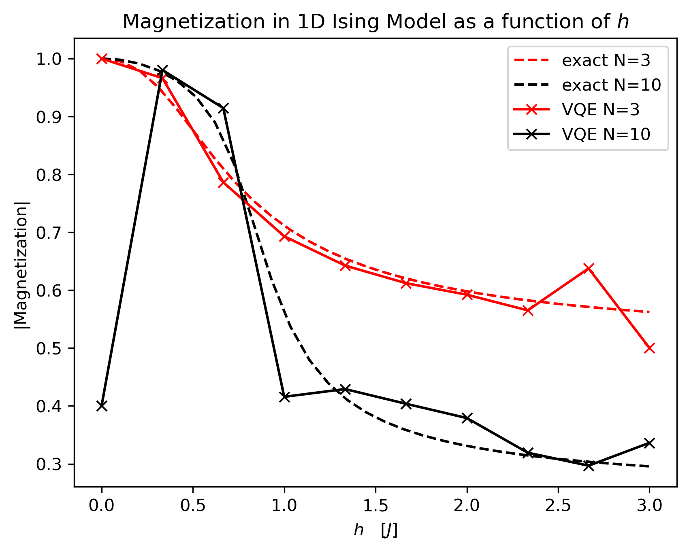
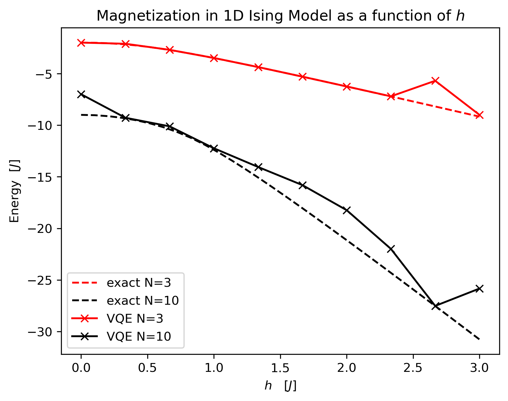

# Quantum Simulation of the 1D Ising Model

The goal here is to simulate the 1D Ising Model on a Quatum Computer, i.e. we design a Quantum Circuit which performs a quantum simulation of the 1D Ising Hamiltonian and performs a measurement of the magnetization.
In addition we determine the ground state and ground state energy using the variational quantum eigensolver (VQE) algorithm. Using these results we find that the 1D Ising model has a quantum phase transition.

## 1D Ising Model
The Ising model describes spin-spin interactions and was conceived as a model for ferromagnetism in statistical physics. It is one of the simplest, analytically solvable (for $D=1,2$) models which feature phase transitions. The 1D realization, which we consider here, does not have a thermal phase transition but a quantum phase transition, which we will study here. Quantum phase transition means that for a specific value of the external magnetic field the ground state and thus the magnetization abruptly jumps.

The Hamiltonian for the $1D$ model for $N$ spins $\vec{S}_i,\, i=0,\ldots ,N-1$ and a transverse magnetric field with magnitude $h$ (which we take to be in the $x$-direction) is given by
$$
H = -J \sum_{i=0}^{N-2} S_i^z S_{i+1}^z - h \sum_{i=0}^{N-1} S_i^x\,,
$$
where $S_i^z$ and $S_i^x$ are the spin projections in the $z$ and $x$ direction, respectively. $J$ is the interaction energy which we take to be $J=1$ in the following, i.e. $h$ is measured in units of $J$ and $t$ in units of $1/J$.

We can express this Hamiltonian in terms of Pauli matrices in order to turn it into an operator that can be acted on $N$ qubit states which model the spins $|s_0\cdots s_{N-1}\rangle$
$$
H = - \sum_{i=0}^{N-2} Z_i Z_{i+1} - h \sum_{i=0}^{N-1} X_i\,,
$$
where this notation means that the Pauli matrices $Z_i$ and $X_i$ are applied to the $i$-th qubit. A more accurate representation includes the tensor products with the identity matrices applied to the remaining spins. As an explicit example, let us consider $N=3$. In this case the Hamiltonian takes the explicit form
$$
H = -Z_1 \otimes Z_2 \otimes I  -  I \otimes Z_2 \otimes Z_3 - h\left( X_1\otimes I \otimes I + I \otimes X_2 \otimes I + I\otimes I \otimes X_3\right)\,,
$$
where $I$ is the identity matrix.

Finally, let us define the magnetization $M$ as the spin sum in the $z$ direction
$$
M = \frac{1}{N}\sum_{i=0}^{N-1} \langle S_i^z\rangle\,.
$$

## Quantum Hamiltonian Simulation
The time evoluation of a quantum state $|\psi\rangle$ under the Hamiltonian $H$ is given by the Schr\"odinger equation (setting $\hbar = 1$)
$$
\frac{d|\psi\rangle}{dt} = -i H |\psi\rangle\,.
$$
The solution to this is
$$
|\psi (t)\rangle = e^{-i H t} |\psi (0)\rangle\,.
$$
For a Hamiltonian that is a tensor product of Pauli matrices $H = \alpha\, \sigma_1 \otimes \sigma_2 \otimes \cdots \otimes \sigma_n$ this can easily be implemented through simple quantum gates. Via unitary operators we can diagonalize the Hamiltonian, i.e. we can express it in terms of the third Pauli matrix only, i.e.
$$
e^{-i t H} = (U_1 \otimes U_2 \otimes \cdots \otimes U_n) e^{-i\alpha t\, Z_1\otimes Z_2\otimes \cdots \otimes Z_n} (U_1^\dagger \otimes U_2^\dagger \otimes \cdots \otimes U_n^\dagger)\,,
$$
where $Z_i$ is the third Pauli matrix acting on the $i$-th qubit. Using that
$$
e^{-i\alpha t\, Z_1\otimes Z_2\otimes \cdots \otimes Z_n} |s_1 \cdots s_n\rangle = e^{-i\alpha t (-1)^{\oplus_i s_i}}|s_1 \cdots s_n\rangle\,,
$$
this can be implemented by constructing $s_1 \oplus s_2 \oplus \cdots \oplus s_n$ in the last qubit with CNOT gates, followed by a $R_z(-\alpha t)$ rotation on the last qubit and the same sequence of CNOT gates in the reverse order to restore the initial state. If the sequence of Pauli matrices contains an identity, the qubit that the identity acts on can simply be ignored. The $U_i$ are easily found using the identities
$$
Y = S H Z H^\dagger S^\dagger\,,\quad X = H Z H^\dagger\,.
$$
As a last step, let us discuss how to simulate Hamiltonians which are a sum of terms of tensor products of Pauli matrices $H= \sum_{i=1}^p H_i$. In that case we can use the Suzuki-Trotter decomposition
$$
e^{-it H} = \left( \prod_{i=1}^m e^{-it H_i / p} \right)^p + \mathcal{O}\left(\frac{(\nu t)^2}{p}\right)\,,
$$
where $\nu = \max_j \{||H_j||\}$.

The magnetization for $N=10$ using the quantum simulation for different values of $p$, compared to the exact numerical simulation is shown in the plot below

## Ground State Magnetization and Ground State Energy
We also determine the ground state and ground state energy using a custom implementation of the variational quantum eigensolver (VQE) algorithm. We find a quantum phase transition at $J=h$, where the magnetization jumps abrubtly from values close to $1$ to values close to $0$, as can be seen in the Figure below

## References
References used for this project include
1. Lecture notes by Andrew M. Childs: https://www.cs.umd.edu/%7Eamchilds/qa/qa.pdf
2. Qiskit Documentation
3. F. Tacchino eta al, "Quantum computers as universal quantum simulators: state-of-art and perspectives" https://arxiv.org/pdf/1907.03505 
4. C. Bauer, Katharina Hyatt, "Quantum Ising Phase Transition," https://juliaphysics.github.io/PhysicsTutorials.jl/tutorials/general/quantum_ising/quantum_ising.html